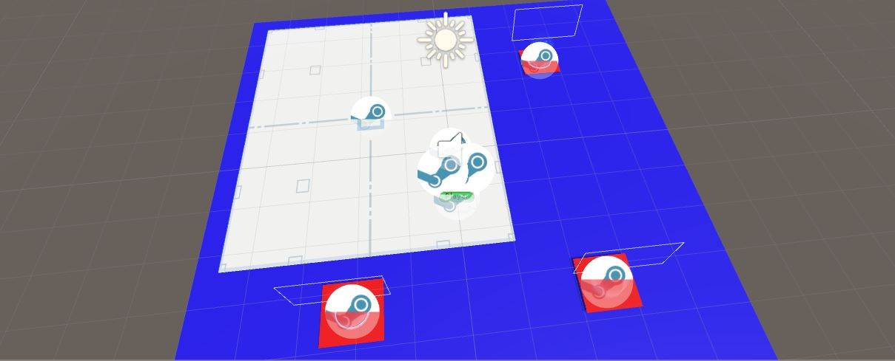

# inclass-SteamVRSetup

Unity Version: 2017.4.15 (recommended by VRND HID program)

Setting up SteamVR for High Immersion VR Development and using teleporting.
I followed this link 
 
https://medium.com/@MrsDragos/steam-vr-updates-how-to-setup-teleport-mechanics-40b76001ae5a

for the setup.

